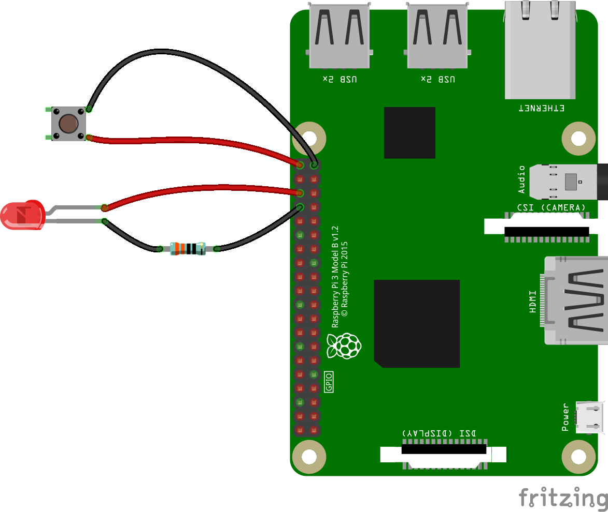

# Dual Video Looper for the Raspberry Pi 4
A shell script dual video looper for the Raspberry Pi 4, making use of the dual HDMI outputs and using omxplayer to run the videos from a USB drive. Also includes a Python3 shutdown button and LED indicator

To install either clone this repo to a Raspberry Pi with wifi setup on it and run setup.sh as root, or run this command:

    curl -L http://bit.ly/2BWGLAW | sudo bash

This setup works best if you set your Pi to auto-login to the terminal as the pi user too...

N.B. It is generally not a good idea to pipe the output of a shortened URL straight into a root shell; but follow the link first and you will see it takes you to the setup.sh file and processes that for you!

To setup the shutdown button and LED you will need to connect a push button and LED to your Raspberry Pi as also shown in the diagram below.

Once everything is installed you can plug a USB stick into your Raspberry Pi with two MP4 videos on it (named hdmi0.mp4 and hdmi1.mp4) and then when you start the Pi up, it will auto mount the USB stick for you and play both video files in a continuous loop until you power the pi off.

To safely shut your Raspberry Pi down, press and hold the shutdown button for three seconds. You will then see the LED flash three times and your Pi will then safely shutdown. Just switch the power off and on again to restart your Video Looper!

This is configured to remove all terminal prompts from your pi, so you will just see a black screen after boot up completes; this is by design! Just start typing your commands!

Tested against Raspbain Buster Lite.

